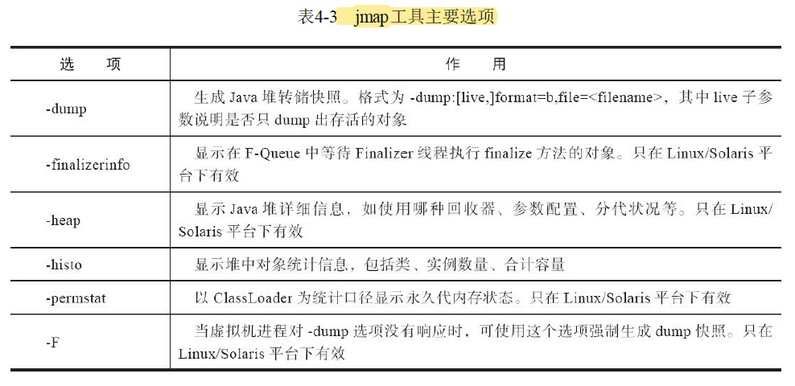

# 第四章 虚拟机性能监控、故障处理工具

## 概述

给一个系统定位问题的时候，知识、经验是关键基础，数据是依据，工具是运用知识处理数据的手段。

## 4.2基础故障处理工具

Java开发人员肯定都知道JDK的bin目录中有java.exe、javac.exe这两个命令行工具，但并非所有程序员都了解过JDK的bin目录下其他各种小工具的作用。

在本章，笔者将介绍这些工具中的一部分，主要是用于监视虚拟机运行状态和进行故障处理的工具。根据软件可用性和授权的不同，可以把它们划分成三类：

* 商业授权工具：主要是JMC（Java Mission Control）及它要使用到的JFR（Java Flight Recorder）。
* 正式支持工具：这一类工具属于被长期支持的工具，不同平台、不同版本的JDK之间，这类工具可能会略有差异，但是不会出现某一个工具突然消失的情况。
* 实验性工具：这一类工具在它们的使用说明中被声明为“没有技术支持，并且是实验性质的”（Unsupported and Experimental）产品，日后可能会转正，也可能会在某个JDK版本中无声无息地消失。但事实上它们通常都非常稳定而且功能强大，也能在处理应用程序性能问题、定位故障时发挥很大的作用。

### 4.2.1 jps：虚拟机进程状况工具

jps（JVM Process Status Tool），它的功能和ps命令类似：可以列出正在运行的虚拟机进程，并显示虚拟机执行主类（Main Class，main()函数所在的类）名称以及这些进程的本地虚拟机唯一ID（LVMID，Local Virtual M achine Identifier）。

jps命令格式：

```
ps [options] [hostid]
```


### 4.2.2 jstat：虚拟机统计信息监视工具

jstat（JVM Statistics M onitoring Tool）是用于监视虚拟机各种运行状态信息的命令行工具。它可以显示本地或者远程虚拟机进程中的类加载、内存、垃圾收集、即时编译等运行时数据，在没有GUI图形界面、只提供了纯文本控制台环境的服务器上，它将是运行期定位虚拟机性能问题的常用工具。

jstat命令格式为：

```
jstat [option vmid [interval[s|ms] [count]] ]
```

对于命令格式中的VMID与IVMID需要特别说明一下：如果是本地虚拟机进程，VMID与LVMID是一致的；如果是远程虚拟机进程，那VMID的格式应当是：

```
[protocal:][//]lvmid[@hostname[:port]/servername]
```

参数interval和count代表查询间隔和次数，如果省略这2个参数，说明只查询一次。假设需要每250毫秒查询一次进程2764垃圾收集状况，一共查询20次，那命令应当是：

```
jstat -gc 2764 250 20
```

选项option代表用户希望查询的虚拟机信息，主要分为三类：类加载、垃圾收集、运行期编译状况。

jstat工具主要选项如下表

)

### 4.2.3 jinfo：Java配置信息工具

jinfo（Configuration Info for Java）的作用是实时查看和调整虚拟机各项参数。如果想知道未被显式指定的参数的系统默认值，除了去找资料外，就只能使用jinfo的-flag选项进行查询了（如果只限于JDK6或以上版本的话，使用`java-XX：+PrintFlagsFinal`查看参数默认值也是一个很好的选择）。jinfo还可以使用-sysprops选项把虚拟机进程的System.getPropertiesO的内容打印出来。这个命令加入了在运行期修改部分参数值的能力（可以使用

`-flag[+|-]name`或者`-flag name=value`在运行期修改一部分运行期可写的虚拟机参数值）。

jinfo命令格式：

```
jinfo [option] pid
```

执行样例：查询CMSInitiatingOccupancyFraction参数值

```
jinfo -flag CMSInitiatingOccupancyFraction 1444
-XX:CMSInitiatingOccypancyFraction=85
```

### 4.2.4 jmap：Java内存映像工具

jmap（Memory Map for Java）命令用于生成堆转储快照（一般称为heapdump或dump文件）。如果不使用jmap命令，要想获取Java堆转储快照也还有一些比较“暴力”的手段：譬如在第2章中用过的

`-XX：+HeapDumpOnOutOfMemoryError`参数，可以让虚拟机在内存溢出异常出现之后自动生成堆转储快照文件，通过`-XX：+HeapDumpOnCtrlBreak`参数则可以使用[Ctrl]+[Break]键让虚拟机生成堆转储快照文件，又或者在Linux系统下通过Kill-3命令发送进程退出信号“恐吓”一下虚拟机，也能顺利拿到堆转储快照。

jmap的作用并不仅仅是为了获取堆转储快照，它还可以查询finalize执行队列、Java堆和方法区的详细信息，如空间使用率、当前用的是哪种收集器等。

和jinfo命令一样，jmap有部分功能在Windows平台下是受限的，除了生成堆转储快照的-dump选项和用于查看每个类的实例、空间占用统计的-histo选项在所有操作系统中都可以使用之外，其余选项都只能在Linux/Solaris中使用。
jmap命令格式：

```
jmap [option] vmid
```

option选项的合法值与具体含义如表4-3所示



### 4.2.5 jhat：虚拟机堆转储快照分析工具

JDK提供jhat（JVM Heap Analysis Tool）命令与jmap搭配使用，来分析jmap生成的堆转储快照。

在实际工作中，除非手上真的没有别的工具可用，否则多数人是不会直接使用ihat命令来分析堆转储快照文件的，主要原因有两个方面：

* 一是一般不会在部署应用程序的服务器上直接分析堆转储快照，即使可以这样做，也会尽量将堆转储快照文件复制到其他机器上进行分析，因为分析工作是一个耗时而且极为耗费硬件资源的过程，既然都要在其他机器上进行，就没有必要再受命令行工具的限制了。
* 另外一个原因是jhat的分析功能相对来说比较简陋，后文将会介绍到的VisuaVM，以及专业用于分析堆转储快照文件的Eclipse Memory Analyzer、IBM HeapAnalyzer等工具，都能实现比jhat更强大专业的分析功能。

### 4.2.6 jstack：Java堆栈跟踪工具

jstack（Stack Trace for Java）命令用于生成虚拟机当前时刻的线程快照（一般称为threaddump或者javacore文件）。线程快照就是当前虚拟机内每一条线程正在执行的方法堆栈的集合，生成线程快照的目的通常是定位线程出现长时间停顿的原因，如线程间死锁、死循环、请求外部资源导致的长时间挂起等，都是导致线程长时间停顿的常见原因。线程出现停顿时通过jstack来查看各个线程的调用堆栈，就可以获知没有响应的线程到底在后台做些什么事情，或者等待着什么资源。

jstack命令格式：

```
jstack [option] vmid
```

option选项的合法值与具体含义如表4-4所示


从JDK5起，java.lang.Thread类新增了一个getAllStackTraces0方法用于获取虚拟机中所有线程的StackTraceElement对象。使用这个方法可以通过简单的几行代码完成jstack的大部分功能，在实际项目中不妨调用这个方法做个管理员页面，可以随时使用浏览器来查看线程堆栈。

### 4.2.7 基础 工具总结

* 基础工具：用于支持基本的程序创建和运行（见表4-5）
  * 
* 安全：用于程序签名、设置安全测试等（见表4-6）
  * 

* 国际化：用于创建本地语言文件（见表4-7）
  * 

* 远程方法调用：用于跨Web或网络的服务交互（见表4-8）
  * 

* 部署工具：用于程序打包、发布和部署（见表4-10）
  * 

* Java Web Start（见表4-11）
  * 

* 性能监控和故障处理：用于监控分析Java虚拟机运行信息，排查问题（见表4-12）
  * 

* WebService工具：与CORBA一起在JDK11中被移除（见表4-13）
  * 

* REPL和脚本工具（见表4-14）
  * 

## 4.3 可视化故障处理工具

这类工具主要包括JConsole、JHSDB、VisualVM和JMC四个。

### 4.3.1 JHSDB：基于服务性代理的调试工具

JDK中提供了JCMD和JHSDB两个集成式的多功能工具箱。

表4-15所示是JCMD、JHSDB与原基础工具实现相同功能的简要对比。


JHSDB是一款基于服务性代理（Serviceability Agent，SA）实现的进程外调试工具。服务性代理是HotSpot虚拟机中一组用于映射Java虚拟机运行信息的、主要基于Java语言（含少量JNI代码）实现的API集合。

JDK7及其以后版本的HotSpot虚拟机选择把静态变量与类型在Java语言一端的映射Class对象存放在一起，存储于Java堆之中。

### 4.3.2 JConsole：Java监视与管理控制平台

### 4.3.3 VisualVM：多合-故障处理工具

### 4.3.4 Java Mission Control：可持续在线的监控工具

以上三节需要实验，等待试验后更新

## 4.4 HotSpot 虚拟机插件及工具

待读。。。