# Nginx


## 产生的原因

用户增多导致服务器压力大

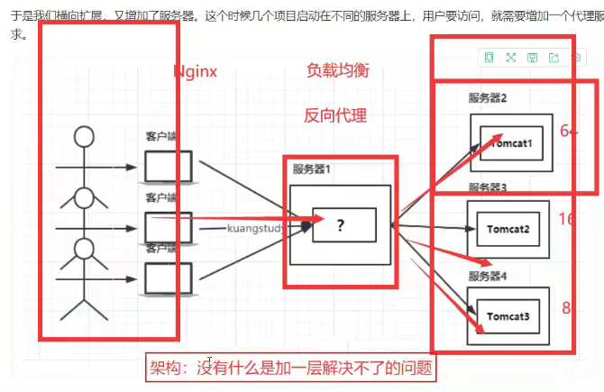


## Nginx是什么

Nginx（engine x）是一个高性能的HTTP和反向代理web服务器，同时也提供了IMAP/POP3/SMTP服务。Nginx是由伊戈尔赛索耶夫为俄罗斯访问量第二的Rambler.ru站点（俄文：PaM6nep）开发的，第一个公开版本0.1.0发布于2004年10月4日。2011年6月1日，nginx1.0.4发布。

其特点是占有内存少，并发能力强，事实上nginx的并发能力在同类型的网页服务器中表现较好，中国大陆使用nginx网站用户有：百度、京东、新浪、网易、腾讯、淘宝等。在全球活跃的网站中有12.18%的使用比率，大约为2220万个网站。

Nginx是一个安装非常的简单、配置文件非常简洁（还能够支持perl语法）、Bug非常少的服务。Nginx启动特别容易，并且几乎可以做到7*24不间断运行，即使运行数个月也不需要重新启动。你还能够不间断服务的情况下进行软件版本的升级。

Nginx代码完全用C语言从头写成。官方数据测试表明能够支持高达50，000个并发连接数的响应。


## Nginx的作用

> Http代理，反向代理：作为web服务器最常用的功能之一，尤其是反向代理。

**正向代理**


**反向代理**


总结：正向代理是代理客户端的，反向代理是代理服务器端的。


## 负载均衡

> Nginx提供的负载均衡策略有2种：内置策略和扩展策略。内策略为轮询，加权轮询，lp hash。扩展策略，就天马行空，只有你想不到的没有他做不到的。

轮询

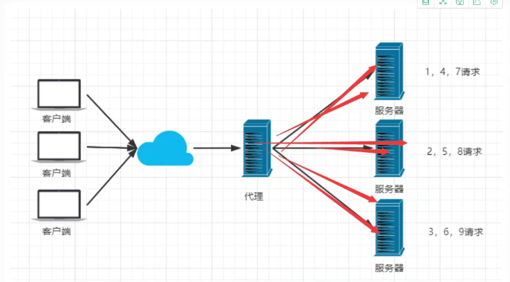


加权轮询

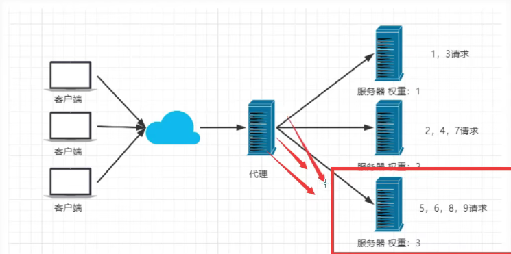


ip hash

iphash对客户端请求的ip进行hash操作，然后根据hash结果将同一个客户端ip的请求分发给同一台服务器进行处理，可以解决seesion不共享的问题。

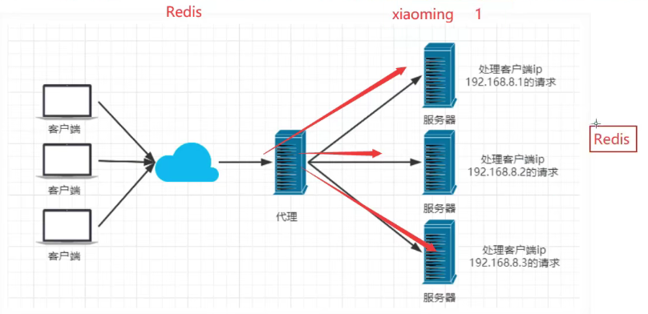


> 动静分离，在我们的软件开发中，有些请求是需要后台处理的，有些请求是不需要经过后台处理的（如：css、html、jpg、js等等文件），这些不需要经过后台处理的文件称为静态文件。让动态网站里的动态网页根据一定规则把不变的资源和经常变的资源区分开来，动静资源做好了拆分以后，我们就可以根据静态资源的特点将其做缓存操作。提高资源响应的速度。

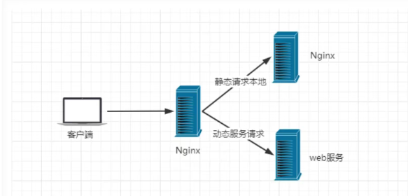


## Nginx安装

### Windows安装

1. 从[Nginx官网](http://nginx.org/en/download.html)下载

   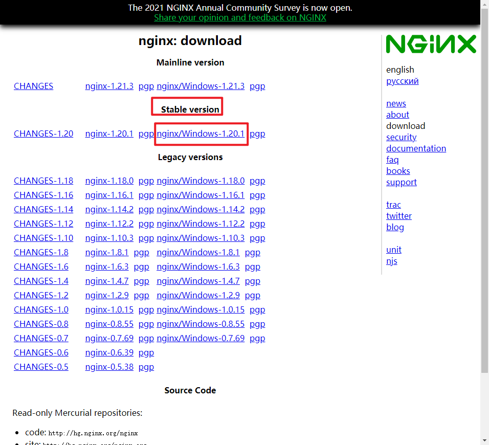

2. 解压，目录如下

   

   Nginx的配置文件：conf/nginx.conf，其中可以看到Nginx的默认端口是80

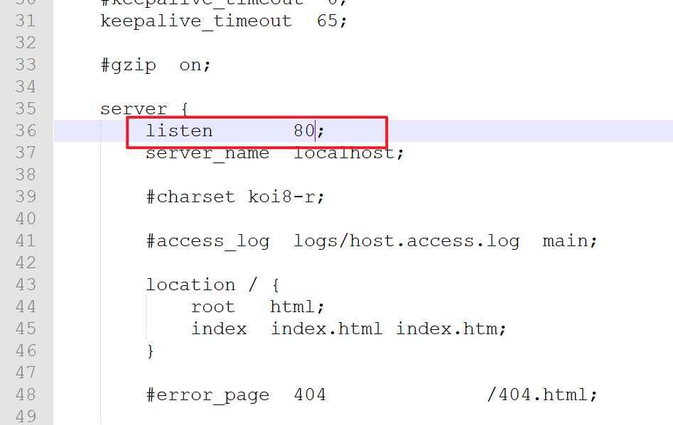

2. 在Nginx的目录下，使用cmd启动nginx

   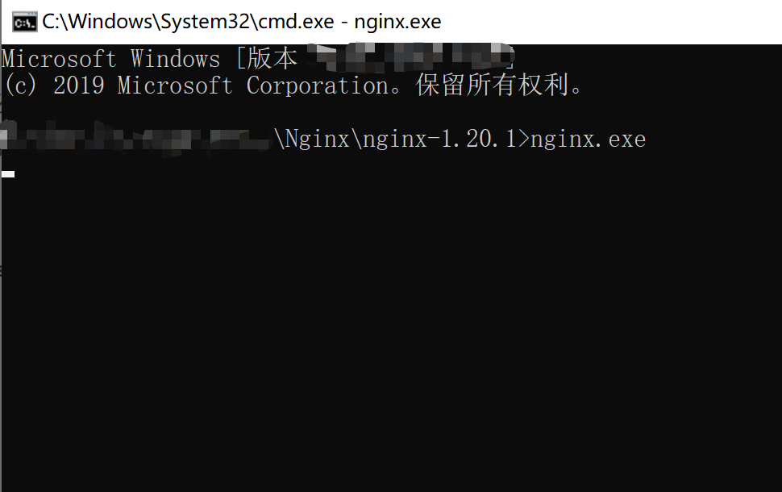

4. Nginx启动完成，访问localhost:80，会出现如下页面

   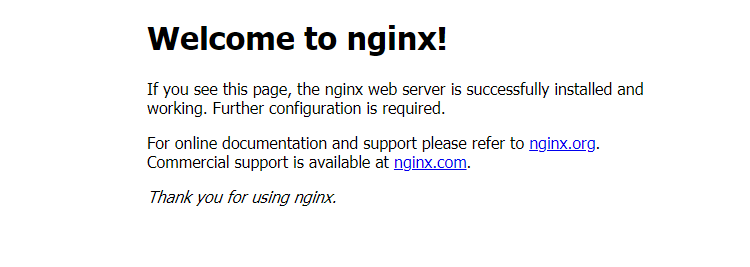

5. Nginx启动成功！！


### Linux安装

1. 下载

   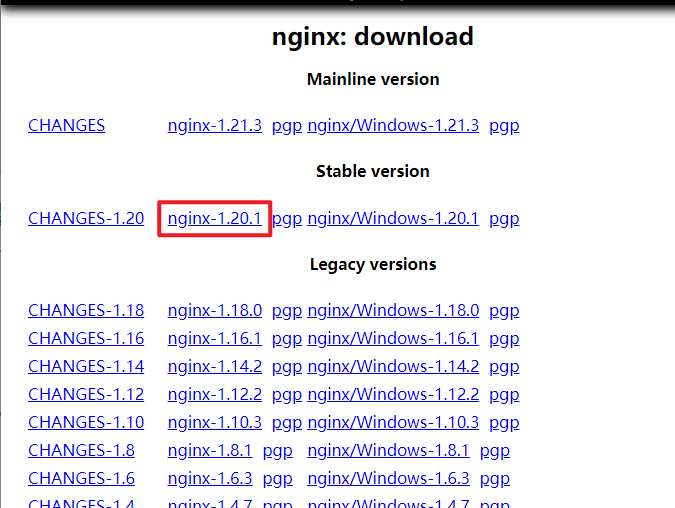

2. 将压缩包放到服务器上，解压，执行如下命令

   ```
   # ./configure
   # make
   # make install
   # whereis nginx
   # cd /usr/local/nginx
   # cd sbin/
   # ./nginx    ——没有报错代表成功了
   
   
   ```

   访问localhost:80，如果访问到Nginx的页面，则启动成功

3. 如果没有启动成功，考虑两个问题
   * 防火墙的80端口是否开启了
   * 如果使用的远程服务器，安全组的80端口是否开启了


## 常用命令

```
cd /usr/local/nginx/sbin
./nginx 启动
./nginx -s stop 停止
./nginx -s quit 安全退出
./nginx -s reload 重新加载配置文件
ps aux|grep nginx 查看nginx进程
```

注意：如果连接不上，检查阿里云安全组是否开放端口，或者服务器防火墙是否开放端口！

**相关命令**

```
# 开启
service firewalld start
# 重启
service firewalld restart
#关闭
service firewalld stop
# 查看防火墙规则
firewall-cmd --list-all
# 查询端口是否开放
firewall-cmd --query-port=8080/tcp
# 开放80端口
firewall-cmd --permanent --add-port=8080/tcp
# 移除端口
firewall-cmd --permanent --remove-port=8080/tcp

# 重启防火墙（修改配置后要重启防火墙）
firewall-cmd --reload

# 参数解释
1、firwall-cmd：是Linux提供的操作firewa11的一个工具；
2、--permanent：表示设置为持久；
3、--add-port；标识添加的端口；
```


## 实际案例

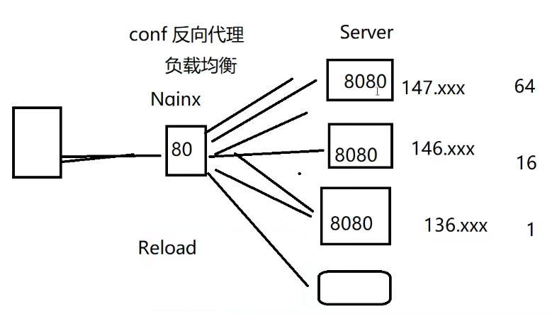


## 总结及展望

做更多的项目，将Nginx使用在实战中


