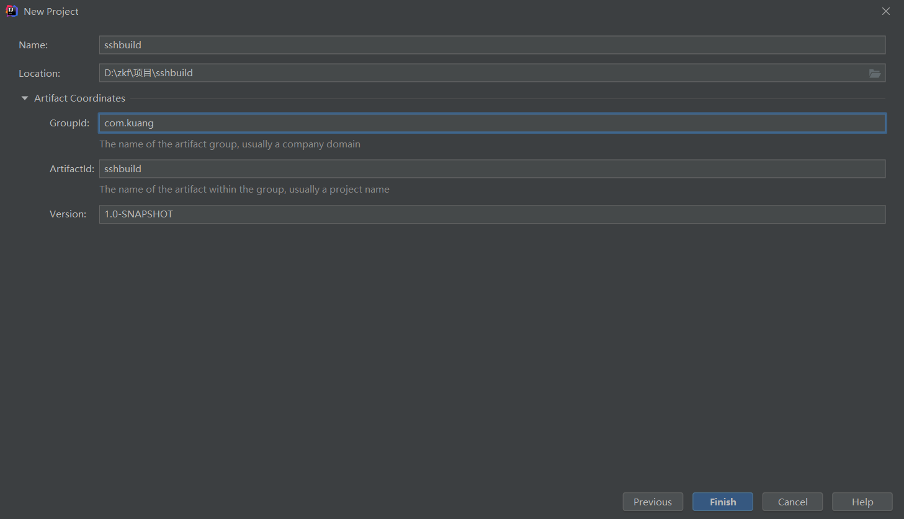
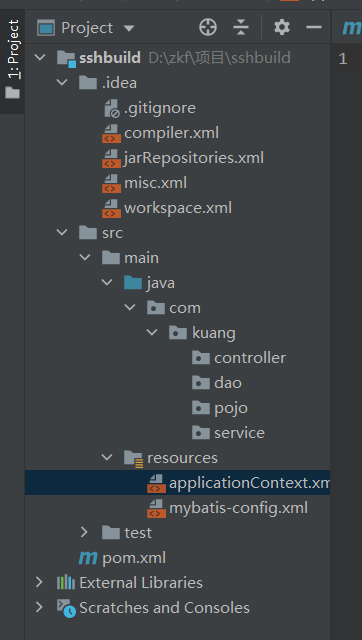
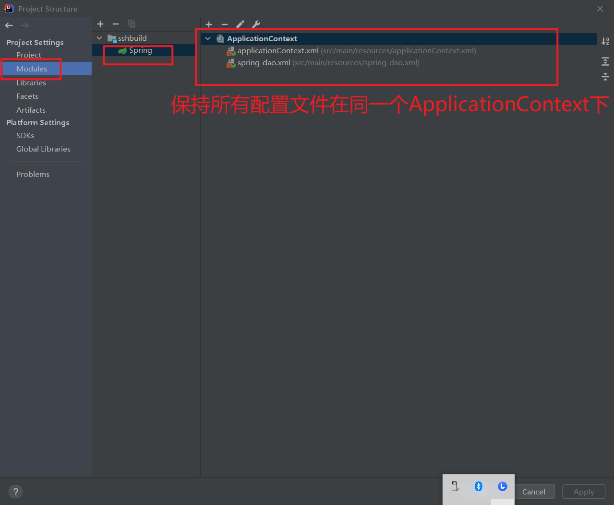
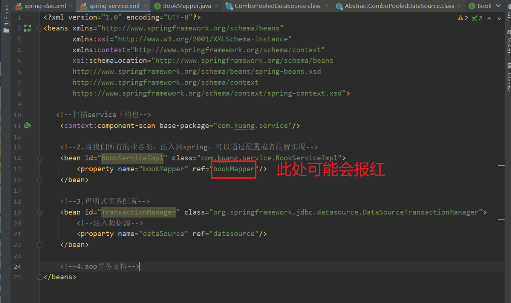
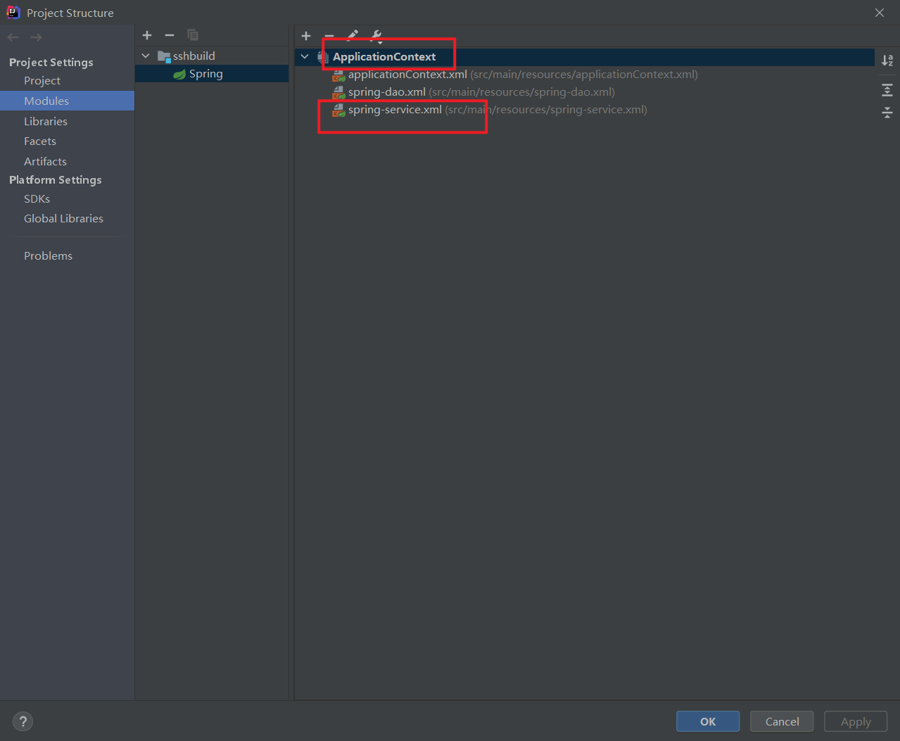
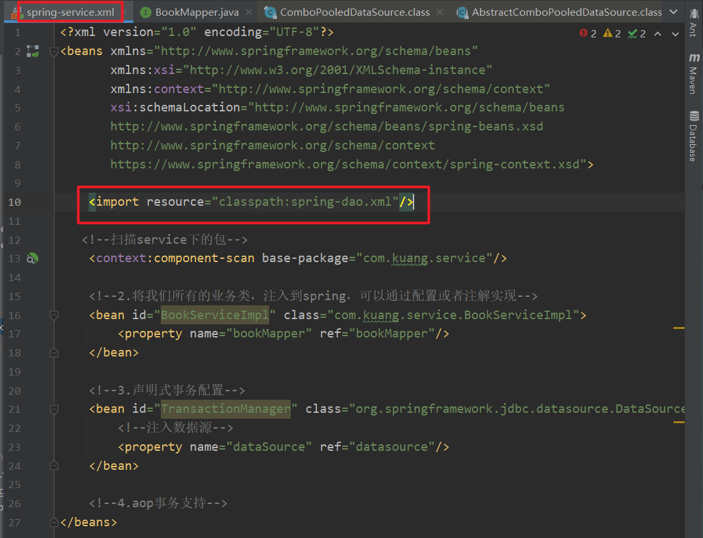
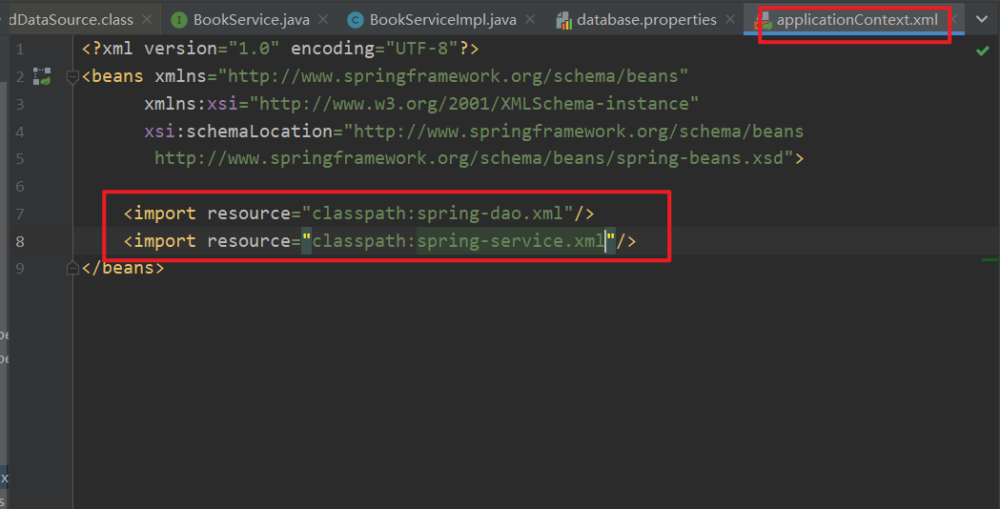
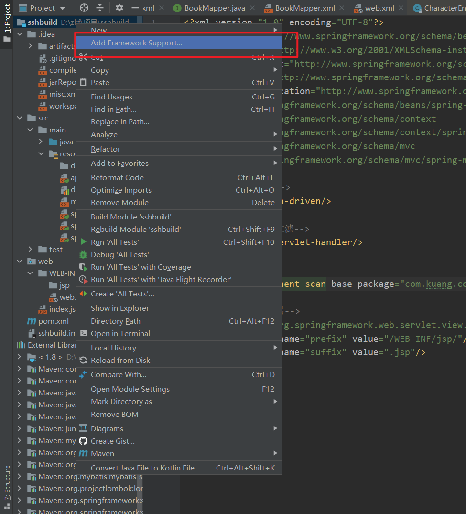
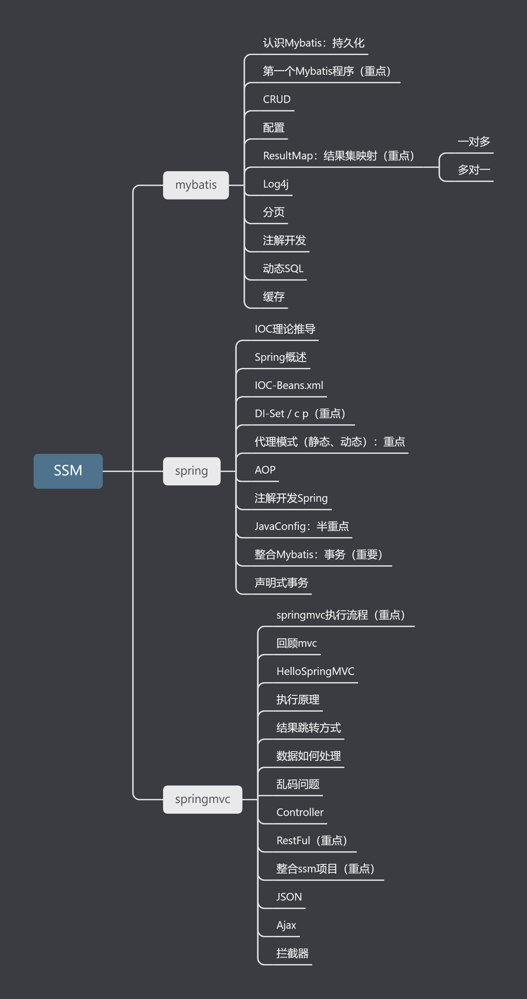

# SpringMVC

现在笔记地址：http://dwz.date/ac27

## 什么是SpringMVC

### 概述

Spring MVC是Spring Framework的一部分，是基于Java实现MVC的轻量级Web框架。

查看官方文档：https://docs.spring.io/spring/docs/5.2.0.RELEASE/spring-framework-reference/web.html#spring-web

**我们为什么要学习SpringMVC呢?**

Spring MVC的特点：

1. 轻量级，简单易学
2. 高效 , 基于请求响应的MVC框架
3. 与Spring兼容性好，无缝结合
4. 约定优于配置
5. 功能强大：RESTful、数据验证、格式化、本地化、主题等
6. 简洁灵活

Spring的web框架围绕**DispatcherServlet** [ 调度Servlet ] 设计。

DispatcherServlet的作用是将请求分发到不同的处理器。从Spring 2.5开始，使用Java 5或者以上版本的用户可以采用基于注解形式进行开发，十分简洁；

正因为SpringMVC好 , 简单 , 便捷 , 易学 , 天生和Spring无缝集成(使用SpringIoC和Aop) , 使用约定优于配置 . 能够进行简单的junit测试 . 支持Restful风格 .异常处理 , 本地化 , 国际化 , 数据验证 , 类型转换 , 拦截器 等等......所以我们要学习 .

### 中心控制器

Spring的web框架围绕DispatcherServlet设计。DispatcherServlet的作用是将请求分发到不同的处理器。从Spring 2.5开始，使用Java 5或者以上版本的用户可以采用基于注解的controller声明方式。

Spring MVC框架像许多其他MVC框架一样, **以请求为驱动** , **围绕一个中心Servlet分派请求及提供其他功能**，**DispatcherServlet是一个实际的Servlet (它继承自HttpServlet 基类)**。


**请使用80%的时间打好扎实的基础，剩下18%的时间研究框架，2%的时间去学点英文，框架的官方文档永远是最好的教程。**


# 搭建项目

### 项目实现步骤

1. 需求分析
2. 设计数据库
3. 业务
4. 前端界面


### 搭建Mybatis层

1. 创建数据库

   ```sql
   CREATE DATABASE `ssmbuild`;
   
   USE `ssmbuild`;
   
   DROP TABLE IF EXISTS `books`;
   
   CREATE TABLE `books` (
   `bookID` INT(10) NOT NULL AUTO_INCREMENT COMMENT '书id',
   `bookName` VARCHAR(100) NOT NULL COMMENT '书名',
   `bookCounts` INT(11) NOT NULL COMMENT '数量',
   `detail` VARCHAR(200) NOT NULL COMMENT '描述',
   KEY `bookID` (`bookID`)
   ) ENGINE=INNODB DEFAULT CHARSET=utf8
   
   INSERT  INTO `books`(`bookID`,`bookName`,`bookCounts`,`detail`)VALUES
   (1,'Java',1,'从入门到放弃'),
   (2,'MySQL',10,'从删库到跑路'),
   (3,'Linux',5,'从进门到进牢');
   ```

2. 创建一个maven项目

   


 3. 导入相关依赖（pom.xml）

    ```xml
    <dependencies>
            
            <!--Junit-->
            <dependency>
                <groupId>junit</groupId>
                <artifactId>junit</artifactId>
                <version>4.12</version>
                <scope>test</scope>
            </dependency>
            
            <!--数据库驱动-->
            <dependency>
                <groupId>mysql</groupId>
                <artifactId>mysql-connector-java</artifactId>
                <version>5.1.47</version>
            </dependency>
            
            <!-- 数据库连接池 -->
            <!-- https://mvnrepository.com/artifact/com.mchange/c3p0 -->
            <dependency>
                <groupId>com.mchange</groupId>
                <artifactId>c3p0</artifactId>
                <version>0.9.5.2</version>
            </dependency>
            
            <!--Servlet - JSP -->
            <dependency>
                <groupId>javax.servlet</groupId>
                <artifactId>servlet-api</artifactId>
                <version>2.5</version>
            </dependency>
            
            <dependency>
                <groupId>javax.servlet.jsp</groupId>
                <artifactId>jsp-api</artifactId>
                <version>2.2</version>
            </dependency>
            
            <dependency>
                <groupId>javax.servlet</groupId>
                <artifactId>jstl</artifactId>
                <version>1.2</version>
            </dependency>
            
            <!--Mybatis-->
            <dependency>
                <groupId>org.mybatis</groupId>
                <artifactId>mybatis</artifactId>
                <version>3.5.7</version>
            </dependency>
            
            <!-- https://mvnrepository.com/artifact/org.mybatis/mybatis-spring -->
            <dependency>
                <groupId>org.mybatis</groupId>
                <artifactId>mybatis-spring</artifactId>
                <version>2.0.6</version>
            </dependency>
            
            <!--Spring-->
            <dependency>
                <groupId>org.springframework</groupId>
                <artifactId>spring-webmvc</artifactId>
                <version>5.1.9.RELEASE</version>
            </dependency>
            <!-- https://mvnrepository.com/artifact/org.springframework/spring-jdbc -->
            <dependency>
                <groupId>org.springframework</groupId>
                <artifactId>spring-jdbc</artifactId>
                <version>5.3.10</version>
            </dependency>
            
        </dependencies>
    
    	<!--静态资源导出问题-->
        <build>
            <resources>
                <resource>
                    <directory>src/main/java</directory>
                    <includes>
                        <include>**/*.properties</include>
                        <include>**/*.xml</include>
                    </includes>
                    <filtering>false</filtering>
                </resource>
                <resource>
                    <directory>src/main/resources</directory>
                    <includes>
                        <include>**/*.properties</include>
                        <include>**/*.xml</include>
                    </includes>
                    <filtering>false</filtering>
                </resource>
            </resources>
        </build>
    ```


4. 建包

   

   建包：com.kuang.controller

   ​			com.kuang.dao

   ​			com.kuang.pojo

   ​			com.kuang.service

   建配置文件：mybatis-config.xml——mybatis的配置文件

   ​						applicationContext.xml——spring的配置文件


5. 关联数据库

   在resources下新建数据库配置文件 **database.properties**

   ```pro
   jdbc.driver=com.mysql.jdbc.Driver
   jdbc.url=jdbc:mysql://localhost:3306/ssmbuild?useSSL=true&useUnicode=true&characterEncoding=utf8
   jdbc.username=root
   jdbc.password=123456
   ```

6. 配置mybatis

   mybatis-config.xml中需要配置数据源，但是现在这一步交给spring去做就好。

   需要给pojo中的类起别名。

   需要注册mapper.xml文件，但是现在还没有mapper.xml，所以先不注册。

   ```xml
   <!--配置数据源：交给Spring去做-->
   
       <!--取别名-->
       <typeAliases>
           <package name="com.kuang.pojo"/>
       </typeAliases>
   ```

7. 新建实体类

   在pojo下新建Books

   ```java
   package com.kuang.pojo;
   
   import lombok.AllArgsConstructor;
   import lombok.Data;
   import lombok.NoArgsConstructor;
   
   @Data
   @AllArgsConstructor
   @NoArgsConstructor
   public class Books {
   
       private int bookID;
       private String bookName;
       private int bookCount;
       private String detail;
   }
   ```

   这里偷懒使用了lombok

8. 新建BookMapper

   在dao下面新建BookMapper接口

   ```java
   package com.kuang.dao;
   
   import com.kuang.pojo.Books;
   
   import java.util.List;
   
   public interface BookMapper {
       //增加一个Book
      int addBook(Books book);
   
      //根据id删除一个Book
      int deleteBookById(int id);
   
      //更新Book
      int updateBook(Books books);
   
      //根据id查询,返回一个Book
      Books queryBookById(int id);
   
      //查询全部Book,返回list集合
      List<Books> queryAllBook();
   }
   
   ```

9. 新建BookMapper.xml

   ```xml
   <?xml version="1.0" encoding="UTF-8" ?>
   <!DOCTYPE mapper
          PUBLIC "-//mybatis.org//DTD Config 3.0//EN"
          "http://mybatis.org/dtd/mybatis-3-mapper.dtd">
   <mapper>
        <!--增加一个Book-->
      <insert id="addBook" parameterType="Books">
         insert into ssmbuild.books(bookName,bookCounts,detail)
         values (#{bookName}, #{bookCounts}, #{detail})
      </insert>
   
      <!--根据id删除一个Book-->
      <delete id="deleteBookById" parameterType="int">
         delete from ssmbuild.books where bookID=#{bookID}
      </delete>
   
      <!--更新Book-->
      <update id="updateBook" parameterType="Books">
         update ssmbuild.books
         set bookName = #{bookName},bookCounts = #{bookCounts},detail = #{detail}
         where bookID = #{bookID}
      </update>
   
      <!--根据id查询,返回一个Book-->
      <select id="queryBookById" resultType="Books">
         select * from ssmbuild.books
         where bookID = #{bookID}
      </select>
   
      <!--查询全部Book-->
      <select id="queryAllBook" resultType="Books">
         SELECT * from ssmbuild.books
      </select>
   
   </mapper>
   ```
   
   在mybatis-config.xml中注册
   
   ```xml
   	<mappers>
           <mapper class="com.kuang.dao.BookMapper"/>
       </mappers>
   ```

10. 在service包下创建BookService以及它的实现类BookServiceImpl

    BookService

    ```java
    package com.kuang.service;
    
    import com.kuang.pojo.Books;
    
    import java.util.List;
    
    public interface BookService {
    
        //增加一个Book
       int addBook(Books book);
    
       //根据id删除一个Book
       int deleteBookById(int id);
    
       //更新Book
       int updateBook(Books books);
    
       //根据id查询,返回一个Book
       Books queryBookById(int id);
    
       //查询全部Book,返回list集合
       List<Books> queryAllBook();
    }
    
    ```

    BookServiceImpl

    ```java
    package com.kuang.service;
    
    import com.kuang.dao.BookMapper;
    import com.kuang.pojo.Books;
    
    import java.util.List;
    
    public class BookServiceImpl implements BookService{
    
        //service调dao层：组合dao
    
        private BookMapper bookMapper;
    
        public void setBookMapper(BookMapper bookMapper) {
            this.bookMapper = bookMapper;
        }
    
        public int addBook(Books book) {
            return bookMapper.addBook(book);
        }
    
        public int deleteBookById(int id) {
            return bookMapper.deleteBookById(id);
        }
    
        public int updateBook(Books books) {
            return bookMapper.updateBook(books);
        }
    
        public Books queryBookById(int id) {
            return bookMapper.queryBookById(id);
        }
    
        public List<Books> queryAllBook() {
            return bookMapper.queryAllBook();
        }
    }
    
    ```

    

### 搭建Spring层

1. 新建spring-dao.xml文件，并将此文件加入到ApplicationContext中

   如何查看spring-dao.xml文件已经加入到ApplicationContext中

   


​		配置spring-dao.xml 

```xml
<?xml version="1.0" encoding="UTF-8"?>
<beans xmlns="http://www.springframework.org/schema/beans"
       xmlns:xsi="http://www.w3.org/2001/XMLSchema-instance"
       xmlns:context="http://www.springframework.org/schema/context"
       xsi:schemaLocation="http://www.springframework.org/schema/beans
       http://www.springframework.org/schema/beans/spring-beans.xsd
       http://www.springframework.org/schema/context
       https://www.springframework.org/schema/context/spring-context.xsd">

    <!--1.关联数据库配置文件-->
    <context:property-placeholder location="classpath:database.properties"/>

    <!--2.连接池
        dbcp：半自动化操作，不能自动连接
        c3p0：自动化操作（自动化的加载配置文件，并可以自动设置到对象中）
        druid
        hikari
        -->
    <bean id="datasource" class="com.mchange.v2.c3p0.ComboPooledDataSource">
        <property name="driverClass" value="${jdbc.driver}"/>
        <property name="jdbcUrl" value="${jdbc.url}"/>
        <property name="user" value="${jdbc.username}"/>
        <property name="password" value="${jdbc.password}"/>

        <!-- c3p0连接池的私有属性 -->
        <property name="maxPoolSize" value="30"/>
        <property name="minPoolSize" value="10"/>
        <!-- 关闭连接后不自动commit -->
        <property name="autoCommitOnClose" value="false"/>
        <!-- 获取连接超时时间 -->
        <property name="checkoutTimeout" value="10000"/>
        <!-- 当获取连接失败重试次数 -->
        <property name="acquireRetryAttempts" value="2"/>
    </bean>

    <!--3.sqlSessionFactory-->
    <bean id="sqlSessionFactory" class="org.mybatis.spring.SqlSessionFactoryBean">
        <property name="dataSource" ref="datasource"/>
        <!--绑定Mybatis的配置文件-->
        <property name="configLocation" value="classpath:mybatis-config.xml"/>
    </bean>

    <!--配置dao接口扫描，动态实现了Dao接口可以注入到Spring容器中-->
    <bean class="org.mybatis.spring.mapper.MapperScannerConfigurer">
        <!--注入sqlSessionFactory -->
        <property name="sqlSessionFactoryBeanName" value="sqlSessionFactory"/>
        <!--扫描dao包-->
        <property name="basePackage" value="com.kuang.dao"/>
    </bean>


</beans>
```


2. 新建spring-service.xml文件，并配置

   ```xml
   <?xml version="1.0" encoding="UTF-8"?>
   <beans xmlns="http://www.springframework.org/schema/beans"
          xmlns:xsi="http://www.w3.org/2001/XMLSchema-instance"
          xmlns:context="http://www.springframework.org/schema/context"
          xsi:schemaLocation="http://www.springframework.org/schema/beans
          http://www.springframework.org/schema/beans/spring-beans.xsd
          http://www.springframework.org/schema/context
          https://www.springframework.org/schema/context/spring-context.xsd">
   
      <!--扫描service下的包-->
       <context:component-scan base-package="com.kuang.service"/>
   
       <!--2.将我们所有的业务类，注入到spring，可以通过配置或者注解实现-->
       <bean id="BookServiceImpl" class="com.kuang.service.BookServiceImpl">
           <property name="bookMapper" ref="bookMapper"/>
       </bean>
   
       <!--3.声明式事务配置-->
       <bean id="TransactionManager" class="org.springframework.jdbc.datasource.DataSourceTransactionManager">
           <!--注入数据源-->
           <property name="dataSource" ref="datasource"/>
       </bean>
   
       <!--4.aop事务支持-->
       <!--配置事务通知-->
       <tx:advice id="txAdvice" transaction-manager="transactionManager">
           <tx:attributes>
               <!--配置哪些方法使用什么样的事务,配置事务的传播特性-->
               <tx:method name="*" propagation="REQUIRED"/>
           </tx:attributes>
       </tx:advice>
   
       <!--配置aop织入事务-->
       <aop:config>
           <aop:pointcut id="txPointcut" expression="execution(* com.kuang.dao.*.*(..))"/>
           <aop:advisor advice-ref="txAdvice" pointcut-ref="txPointcut"/>
       </aop:config>
   </beans>
   ```

   有可能遇到的问题

   

   解决：

   方法1：

   

​		保证spring-service.xml文件放到了ApplicationContext下


​		方法2：



​		

​		方法3：		


### 搭建SpringMVC层

1. 引入web

   

2. 配置web.xml

   ```xml
   <?xml version="1.0" encoding="UTF-8"?>
   <web-app xmlns="http://xmlns.jcp.org/xml/ns/javaee"
            xmlns:xsi="http://www.w3.org/2001/XMLSchema-instance"
            xsi:schemaLocation="http://xmlns.jcp.org/xml/ns/javaee http://xmlns.jcp.org/xml/ns/javaee/web-app_4_0.xsd"
            version="4.0">
   
       <!--DispatchServlet-->
       <servlet>
           <servlet-name>springmvc</servlet-name>
           <servlet-class>org.springframework.web.servlet.DispatcherServlet</servlet-class>
           <init-param>
               <param-name>contextConfigLocation</param-name>
               <param-value>classpath:applicationContext.xml</param-value>
           </init-param>
           <load-on-startup>1</load-on-startup>
       </servlet>
       <servlet-mapping>
           <servlet-name>springmvc</servlet-name>
           <url-pattern>/</url-pattern>
       </servlet-mapping>
   
       <!--乱码过滤-->
       <filter>
           <filter-name>encodingFilter</filter-name>
           <filter-class>org.springframework.web.filter.CharacterEncodingFilter</filter-class>
           <init-param>
               <param-name>encoding</param-name>
               <param-value>utf-8</param-value>
           </init-param>
       </filter>
       <filter-mapping>
           <filter-name>encodingFilter</filter-name>
           <url-pattern>/*</url-pattern>
       </filter-mapping>
   
       <!--Session过期时间-->
       <session-config>
           <session-timeout>15</session-timeout>
       </session-config>
   </web-app>
   ```

2. 新建spring-mvc.xml，并配置

   ```xml
   <?xml version="1.0" encoding="UTF-8"?>
   <beans xmlns="http://www.springframework.org/schema/beans"
         xmlns:xsi="http://www.w3.org/2001/XMLSchema-instance"
         xmlns:context="http://www.springframework.org/schema/context"
         xmlns:mvc="http://www.springframework.org/schema/mvc"
         xsi:schemaLocation="http://www.springframework.org/schema/beans
      http://www.springframework.org/schema/beans/spring-beans.xsd
      http://www.springframework.org/schema/context
      http://www.springframework.org/schema/context/spring-context.xsd
      http://www.springframework.org/schema/mvc
      https://www.springframework.org/schema/mvc/spring-mvc.xsd">
       
       <!--配置SpringMVC-->
       <!--1.注解驱动-->
       <mvc:annotation-driven/>
   
       <!--2.静态资源过滤-->
       <mvc:default-servlet-handler/>
   
       <!--3.扫描包-->
       <context:component-scan base-package="com.kuang.controller"/>
   
       <!--4.视图解析器-->
       <bean class="org.springframework.web.servlet.view.InternalResourceViewResolver">
           <property name="prefix" value="/WEB-INF/jsp/"/>
           <property name="suffix" value=".jsp"/>
       </bean>
   
   </beans>
   ```

3. 配置**Spring配置整合文件，applicationContext.xml**（如果下面的配置文件已经都加入到ApplicationContext.xml中，这一步可以不用配置）

   ```xml
   <?xml version="1.0" encoding="UTF-8"?>
   <beans xmlns="http://www.springframework.org/schema/beans"
         xmlns:xsi="http://www.w3.org/2001/XMLSchema-instance"
         xsi:schemaLocation="http://www.springframework.org/schema/beans
          http://www.springframework.org/schema/beans/spring-beans.xsd">
   
      <import resource="spring-dao.xml"/>
      <import resource="spring-service.xml"/>
      <import resource="spring-mvc.xml"/>
      
   </beans>
   ```

   

### 至此，项目搭建完成！

接下来可以进行业务代码的书写


# 搭建项目流程（简略版）

创建基本项目

1. 创建数据库
2. 创建maven项目
3. 导入相关依赖。包括Junit，数据库驱动，数据库连接池，servlet，jsp，jstl，mybatis，mybatis-spring，spring-webmvc，spring-jdbc以及解决静态资源导出问题

4. 建包，包括controller，dao，pojo，service，mybatis.xml，applicationContext.xml
5. 新建数据库配置文件并配置

配置mybatis层

1. 配置mybatis，起别名
2. 新建实体类
3. 新建mapper和mapper.xml，并注册mapper.xml
4. 新建service和serviceImpl

配置Spring层

1. 新建spring-dao.xml，配置——关联数据库文件，连接池，sqlSessionFactory，动态接口扫描dao
2. 新建spring-service.xml，配置——扫描service，业务类注入，声明式事务，aop事务支持

配置SpringMVC层

1. 引入Web
2. 配置web.xml——DispatchServlet，乱码过滤，Session过期时间
3. 新建spring-mvc.xml，并配置——注解驱动，静态资源过滤，扫描包，视图解析器
4. 配置**Spring配置整合文件，applicationContext.xml**

完成！！！


# Java全栈工程师

* 后端开发：主打
* 前端：html,css,js,jQuery
* 运维：项目发布；服务器如何运行一个项目？Linux


# SSM总体回顾


